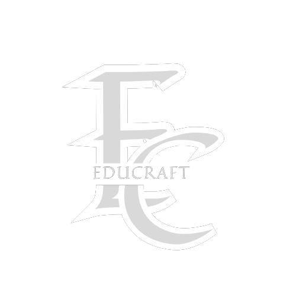

# EduCraft

_Empowering Minds Through Interactive Learning Experiences and Seamless Progress Tracking._

## Introduction

EduCraft is not just another Learning Management System (LMS); it's a passion project born out of a desire to revolutionize the educational experience. Inspired by the challenges faced in traditional learning environments, EduCraft was envisioned as a tool to make education interactive, engaging, and tailored to individual needs.



For a live demo, visit [EduCraft Demo](https://www.educraft-demo.com).

Read about the journey and development process in our [Final Project Blog Article](https://medium.com/@abdulazeezsalihu41/educraft-empowering-learning-through-a-seamless-educational-experience-0f56dc88edc2).

**Authors:**

- Abdulazeez Salihu - [LinkedIn](https://www.linkedin.com/in/Abdulazeez/)

## The Story Behind EduCraft

The seed for EduCraft was planted during late-night brainstorming sessions, fueled by the frustration of conventional LMS platforms lacking the spark to truly engage students. I envisioned an immersive learning environment where students could explore subjects through interactive games and activities.

**Technical Challenges and Solutions**

- **Choosing Flask for Flexibility:**
  EduCraft's foundation is built on Flask, a micro web framework for Python. The decision was rooted in its simplicity, flexibility, and the ability to scale seamlessly as the project evolved.

  ```python
  # Example code snippet from EduCraft
  from flask import Flask, render_template

  app = Flask(__name__)

  @app.route('/')
  def home():
      return render_template('index.html')
  ```

- **User Authentication with Flask-Login:**
  EduCraft needed robust user authentication to ensure a personalized experience. Flask-Login proved to be the ideal solution, providing seamless integration with Flask.

  ```python
  # Flask-Login integration in EduCraft
  from flask_login import LoginManager, UserMixin, login_user

  login_manager = LoginManager(app)
  ```

## The Human Touch

EduCraft is more than lines of code; it's a reflection of countless late nights, passionate discussions, and shared frustration with the status quo. As you explore the project, remember there's a human behind every commit, someone who believes in the power of education to transform lives.

## Struggles and Future Iterations

While developing EduCraft, i faced challenges—bugs that seemed impossible to squash, design choices that kept us up at night, and moments of self-doubt. This project is a testament to perseverance and continuous learning.

In the next iteration, i plan to enhance user interactivity, introduce AI-driven recommendations, and expand the range of subjects. I invite the community to contribute ideas and code to make EduCraft even more impactful.

## Installation

To run EduCraft locally, follow these steps:

1. Clone the repository:

   ```bash
   git clone https://github.com/Abdulazeez41/EduCraft.git
   ```

2. Navigate to the project directory:

   ```bash
   cd EduCraft
   ```

3. Create a virtual environment:

   ```bash
   python3 -m venv venv
   ```

4. Activate the virtual environment:

   - On Windows:

     ```bash
     .\venv\Scripts\activate
     ```

   - On Unix or MacOS:

     ```bash
     source venv/bin/activate
     ```

5. Install dependencies:

   ```bash
   pip3 install -r requirements.txt
   ```

6. Run the application:

   ```bash
   python3 app.py
   ```

   The application will be accessible at `http://localhost:5001` by default.

## Usage

EduCraft offers a dynamic learning experience. Explore the various educational games and activities, track progress through interactive dashboards, and witness the power of personalized education.

## Contributing

I welcome contributions from the community. If you'd like to contribute to EduCraft, please follow the guidelines in [CONTRIBUTING.md](CONTRIBUTING.md).

Please make sure to follow our [Code of Conduct](CODE_OF_CONDUCT.md).

## Related Projects

Check out these related projects:

- [The Odin Project](https://github.com/TheOdinProject/theodinproject)
- [FullStackOpen](https://github.com/fullstackopen-2021/fullstackopen-2021)

## Licensing

EduCraft is licensed under the [MIT License](LICENSE).

---
